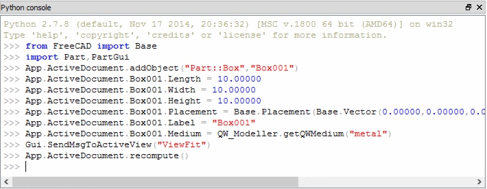

# Python 3.9: What’s new and better

+ Major Python update brings a faster release schedule, performance boosts, handy new string functions,
 dictionary union operators, and more consistent and stable internal APIs.
     
      + More Python string and dictionary functions
      
      + Decorators lose some restrictions
      
      + New Python type operations
      
      
       
      
      + Improvements to Python internals
      
      + Other changes in Python 3.9
      
      + Type Hinting Generics in Standard Collections
      
      + New Modules
          
           + zoneinfo
           
      + CPython bytecode changes
      
      + C API Changes
      
      
      
 
 
 
 
 
 
 
  
  
  
  
  
  

   
